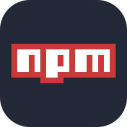

# Flow Zone

Flow Zone is a small clone project inspired by [pomofocus.io](https://pomofocus.io). This application is built with React and styled with Styled Components. It employs the Pomodoro Technique, helping users break down their work into focused intervals interspersed with short breaks. This approach enhances concentration, minimizes distractions, and ultimately boosts overall productivity.

## Getting Started

Welcome to Flow Zone! This application helps you improve focus and productivity by implementing the Pomodoro Technique.

To start, you can customize the duration of your Focus, Short Break, and Long Break intervals. Then, begin a session and let Flow Zone guide you through the Pomodoro cycles.

## Features

- Focus Mode timer
- Short Break timer
- Long Break timer
- Visual timer progress bar
- Sound notifications (optional)
- Ability to customize timer durations

## Tools and Technologies

## Installation and Usage

1. Clone the repository: `git clone https://github.com/akosikhada/flow-zone.git`
2. Navigate to the project directory: `cd flow-zone`
3. Install dependencies: `npm install`
4. Start the development server: `npm run dev`

## What is Pomodoro Technique?

The Pomodoro Technique was created by Francesco Cirillo as a more productive way to work and study. The technique uses a timer to break down work into intervals, traditionally 25 minutes in length, separated by short breaks. Each interval is known as a pomodoro, from the Italian word for 'tomato', after the tomato-shaped kitchen timer that Cirillo used as a university student.

## License

This project is licensed under the [MIT License](LICENSE).

## Inspired by pomofocus.io

